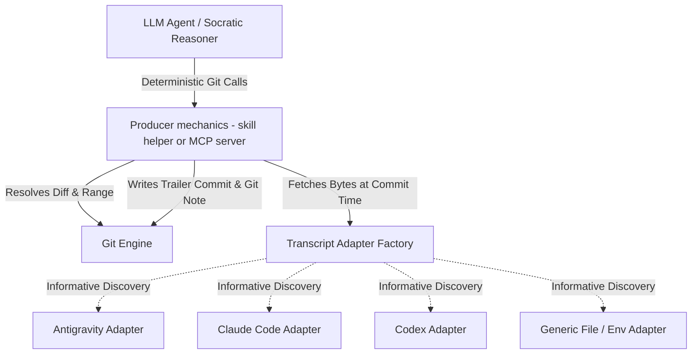

# Specification: Portable Git Signoff Attestation (GSA) Protocol Core

**Document Version:** 3.6.0 (single-valued trailer rule: producers keep values on one line, verifiers reject repeated single-valued trailers within one attestation; merged-note anchoring scoped to the annotated object; §2.2 and §4 reworded from "the MCP server" to "the producer" — the MCP interface is one informative producer shape, not a required component)  
**Status:** Draft / Pending Review  
**Target Scope:** `signoff` skill portability, producer implementations (skill layer; optionally an MCP server), Harness Adapters, Git Notes Attestation, and Open Commit Protocol Core  
**Canonical Spec Location:** `skills/signoff/specs/gsa-core.md`  
**License:** This specification is licensed under the [Community Specification License 1.0](https://github.com/jerrylin96/git-signoff/blob/main/LICENSE-SPEC) (SPDX: `Community-Spec-1.0`); the reference implementations in this repository remain MIT.  

---

## 1. Executive Summary & Philosophy

The **Git Signoff Attestation (GSA) Protocol** defines an open, harness- and model-agnostic specification for AI-assisted human code attestation.

### 1.1 Core Purpose & Trust Model
* **Accountability & Audit Trail:** GSA provides a structured, machine-parsable audit log of human comprehension, intent, and risk acceptance inside Git.
* **Honest Trust Boundary:** GSA does not claim unforgeable proof of human cognition. Instead, it pairs Socratic agent interrogation with Git state verification, Git Notes persistence, and optional GPG/SSH signed commits (`git commit -S`) to establish verifiable human accountability.

---

## 2. Protocol Specification: Standardized Git Attestation Format

Attestations are recorded as empty Git commits (`git commit --allow-empty`) on feature branches AND mirrored into dedicated Git Notes (`refs/notes/signoff`) to guarantee survival across squash merges and branch deletions.

### 2.1 Commit & Note Metadata Schema

```text
[SIGNOFF <reviewed-commit-short-sha>]: human comprehension and risk attestation

<optional Socratic review summary paragraph>

Signoff-Spec-Version: 1.0
Signoff-Status: <STATUS>
Signoff-Timestamp: <ISO-8601 UTC timestamp>
Signoff-Base-SHA: <merge-base-sha>
Signoff-Reviewed-Commit-SHA: <reviewed-commit-sha>
Signoff-Reviewed-Tree-SHA: <reviewed-tree-sha>
Signoff-Harness-ID: <harness-id>
Signoff-Conversation-ID: <conversation-id-or-unavailable>
Signoff-Transcript-Digest: <transcript-digest-or-unavailable>
Signoff-Transcript-Bytes: <byte-count-or-unavailable>
Signoff-Tradeoff: <acknowledged-tradeoff-1>
Signoff-Tradeoff: <acknowledged-tradeoff-2>
Signoff-Risk: <acknowledged-risk-1>
Signoff-Verified-By: <confirmed-user-email>
Signoff-Agent: harness=<harness-id>/<version|N/A> model=<model-id|N/A> reasoning=<level|N/A> interview=<intensity-level>/<profile-id>[/sha256:<profile-digest-prefix>]
```

*(Note: Optional cloud trailers like `Signoff-Cloud-Attestation-URL` are omitted entirely when unconfigured rather than written as `none`.)*

### 2.2 Status Field Enum & Producer Enforcement

| Status Value | Meaning | Producer Derivation & Enforcement Logic |
|---|---|---|
| `VERIFIED_BY_HUMAN` | Socratic interview completed; transcript resolved and hashed successfully. | Set by the producer if the `TranscriptProvider` returns valid bytes and digest. |
| `VERIFIED_BY_HUMAN_NO_TRANSCRIPT_DIGEST` | Socratic interview completed; transcript unavailable locally. | Set by the producer ONLY if the `TranscriptProvider` returns `None` AND the human has explicitly acknowledged the downgrade (`ack_no_transcript=True`). Without that acknowledgement the producer MUST abort the commit with an error. |

*(Note: `Signoff-Status` is derived deterministically by the producer from transcript availability; the interviewing agent MUST NOT set it directly. "Producer" is whatever writes the attestation — the skill layer's helper in the shipped implementation, or an MCP server exposing the §4 interface.)*

**Transcript Outcome & Status Cross-Field Rule:** An attestation MUST record its transcript outcome explicitly: `VERIFIED_BY_HUMAN` requires a well-formed `sha256:<64-hex>` `Signoff-Transcript-Digest` (and matching byte count); when no transcript bytes were captured or resolved, the digest MUST be `unavailable` and the status MUST be `VERIFIED_BY_HUMAN_NO_TRANSCRIPT_DIGEST`. An attestation omitting the digest trailer or pairing `VERIFIED_BY_HUMAN` with `unavailable` is invalid under either status.

### 2.3 Field Rules & Conventions
- **Trailer keys are case-sensitive** and MUST be written exactly as shown in §2.1 (`Signoff-Spec-Version`, `Signoff-Reviewed-Tree-SHA`, …). Verifiers MUST NOT match case variants: a case-variant key is not that trailer, so a payload whose mandatory trailers appear only in variant casing is invalid. (Clarified after two implementations disagreed; the conformance suite pins this via `invalid-lowercase-keys.txt`.)
- `Signoff-Spec-Version`: `1.0` (standalone machine-parsable protocol version).
- `Signoff-Base-SHA`: Computed dynamically via `git merge-base <reference-commit> <reviewed-commit-sha>` (no hardcoded remote assumptions).
- `Signoff-Reviewed-Commit-SHA`: 40-character SHA of commit inspected during interview.
- `Signoff-Reviewed-Tree-SHA`: 40-character tree SHA (`git rev-parse <reviewed-commit-sha>^{tree}`). Primary anchor for squash-merge / rebase verification.
- `Signoff-Transcript-Digest` & `Signoff-Transcript-Bytes`:
  - **Snapshot Timing:** The byte count and SHA256 digest MUST be captured synchronously inside `signoff_commit` upon final user approval, immediately before writing the commit/note.
  - The digest is calculated strictly over the first `Signoff-Transcript-Bytes` of the transcript file captured at commit time.
  - *Append-only Assumption:* First-N-bytes re-verification assumes append-only transcript logs. For harnesses with compaction/resume overwrites, mirroring transcript payloads to `refs/notes/signoff` or cloud archives provides complete immutability.
- `Signoff-Tradeoff` & `Signoff-Risk`:
  - **Repeat Rule:** Repeat the trailer key for each item acknowledged during interview.
  - **Empty Rule:** Write `Signoff-Tradeoff: none` or `Signoff-Risk: none` exactly once if zero items were identified.
- **Single-Valued Trailers (all others):** Within one attestation, every trailer other than `Signoff-Tradeoff` and `Signoff-Risk` MUST appear exactly once if required (§2.1) and at most once if optional. Producers MUST write each value on a single line: free text (trade-offs, risks, the summary paragraph, the agent string, the email) MUST NOT contain line breaks, and no line of the summary paragraph may begin with `Signoff-`; a producer MUST refuse such input rather than write it. Verifiers MUST treat a payload that is one attestation — an attestation commit message, or one block of a note — as invalid when a single-valued trailer appears more than once, and MUST NOT use any value from such a payload to anchor a commit or tree. Rationale: the format is line-oriented, so a line break inside a trade-off is the difference between a comment and a second `Signoff-Reviewed-Tree-SHA` that anchors an unreviewed tree. (Added in 3.6.0 after the reference verifier was shown to accept exactly that; the conformance suite pins it via `invalid-duplicate-reviewed-tree-sha.txt`.)
- `Signoff-Agent` (Interviewer Provenance):
  - **Grammar (SHOULD):** `harness=<id>/<version|N/A> model=<model-id|N/A> reasoning=<level|N/A> interview=<intensity-level>/<profile-id>[/sha256:<profile-digest-prefix>]` — space-separated `key=value` tokens in this fixed order, each value matching `[A-Za-z0-9._:/-]+`; the literal `N/A` marks fields the harness does not expose. The optional `/sha256:<profile-digest-prefix>` segment (12-hex prefix of the SHA256 of the delimited profile block) is REQUIRED when the interview profile was resolved from a file (resolution order defined in the skill layer: `SIGNOFF_PROFILE_FILE` env override → `<repo>/.signoff/profile.md` → embedded default block) and MUST be omitted when the embedded shipped block ran — verifiers can thereby distinguish shipped question sets from repo-authored ones.
  - **Sourcing:** `harness` mirrors `Signoff-Harness-ID` plus the harness version. `model` and `reasoning` identify the interviewing agent, deterministically sourced where the harness provides them (environment variables, transcript metadata from the same snapshot bytes as the digest), agent-self-reported otherwise. `interview` records the interview-intensity level actually run and the active INTERVIEW PROFILE identifier (both defined in the skill layer, `skills/signoff/SKILL.md`).
  - **Backward Compatibility:** Values not matching this grammar (including all pre-3c attestations) remain valid opaque strings; verifiers MUST NOT reject an attestation on `Signoff-Agent` format.

### 2.4 Cryptographic Developer Identity Binding
To bind an attestation to a verified human developer identity:
* Implementations SHOULD execute `git commit -S --allow-empty` when GPG/SSH commit signing keys (`user.signingkey`) are configured in the local Git environment.
* Attestations can be validated using `git verify-commit <attestation-sha>` and platform status flags (e.g., GitHub Verified status).

### 2.5 Attestation Persistence & Concurrency via Git Notes (`refs/notes/signoff`)
To ensure attestations survive post-merge branch deletion and squash merges:
1. Every signoff execution writes the trailer payload to an empty commit AND attaches it to `refs/notes/signoff` on `<reviewed-commit-sha>` and `<reviewed-tree-sha>`.
2. **Concurrency Merge Strategy:** To prevent non-fast-forward push rejections in multi-developer environments, pushes MUST fetch remote notes into a separate tracking ref, merge them into the local signoff notes ref using the `cat_sort_uniq` strategy, and only then push:
   ```bash
   git fetch origin +refs/notes/signoff:refs/notes/signoff-remote
   git notes --ref=signoff merge -s cat_sort_uniq refs/notes/signoff-remote
   git push origin refs/notes/signoff
   ```
   Fetching directly into the local `refs/notes/signoff` is a non-fast-forward update whenever local and remote notes have diverged and is rejected; the `+`-forced tracking ref sidesteps this on repeat runs, and `--ref=signoff` ensures the merge targets the signoff notes ref rather than the default `refs/notes/commits`.

---

## 3. Pluggable Architecture: Adapters & Deterministic Engine



### 3.1 `TranscriptProvider` Minimal Interface Specification

To guarantee identical hashing across all adapters, the adapter is responsible only for locating and fetching raw transcript bytes; the GSA core engine computes digests and byte offsets.

```python
from typing import Protocol

class TranscriptProvider(Protocol):
    """Minimal interface for transcript discovery across AI agent runtimes."""
    
    def resolve_conversation_id(self) -> str | None:
        """Returns the active conversation/session ID string, or None if unresolvable."""
        ...
        
    def fetch_transcript_bytes(self) -> bytes | None:
        """Returns raw transcript file bytes as a snapshot at call time, or None if unavailable."""
        ...
```

### 3.2 Informative Harness Adapter Reference Matrix

*Harness storage formats are non-normative and adapter-owned.*

1. **`AntigravityAdapter`**:
   - Env: `ANTIGRAVITY_CONVERSATION_ID`
   - Path: `~/.gemini/antigravity-cli/brain/{cid}/.system_generated/logs/transcript.jsonl`
2. **`ClaudeCodeAdapter`**:
   - Env: `CLAUDE_CODE_SESSION_ID`
   - Path: `~/.claude/projects/<cwd-path-slug>/<session-id>.jsonl` (where `<cwd-path-slug>` is absolute working directory path with `/` converted to `-`).
3. **`CodexAdapter`**:
   - Env: `CODEX_SESSION_ID` (optional `CODEX_HOME`)
   - Path: `$CODEX_HOME/sessions/**/rollout-*-{session-id}.jsonl` (newest by mtime, tie-broken by path)
4. **`GenericFileAdapter`**:
   - Env: `SIGNOFF_TRANSCRIPT_FILE=/path/to/transcript.log`

---

## 4. Scoped Model Context Protocol (MCP) Interface (informative)

*Status: informative. This section specifies the tool surface a producer SHOULD expose if it offers GSA mechanics over MCP. No MCP server ships in this repository: one did from 2026-08 to 2026-09-08 and was removed for lack of adopter demand; the mechanics it wrapped remain as the `git_signoff` Python reference library and in the skill layer's helper. The interface is kept so that independent implementations converge on the same tool names and semantics.*

The Socratic interrogation logic (probing 4 axes, evaluating user clarity) remains in the LLM agent prompt. An MCP producer is strictly scoped to **deterministic Git state and diff mechanics**.

### 4.1 MCP Tools

* **`signoff_prepare(target_ref: str)`**:
  - Resolves `reviewed_commit_sha`, `base_sha`, and `tree_sha`.
  - Generates raw range diff, modified file list, and patch stats for LLM Socratic auditing.
  - Detects active `TranscriptProvider` and returns current transcript status (informative only).
  - Reports the resolved interview profile (source, path, `Profile-ID`, 12-hex block digest — the skill-layer resolution order of §2.3, with an unreadable `SIGNOFF_PROFILE_FILE` aborting and a malformed file-sourced profile falling back to the embedded default with the reason surfaced) and the science-guard signal categories detected in the range diff (informative mirror of the skill layer's Section 1 step 5 and science-detection escalation guard; the agent prompt remains authoritative for interview conduct).
* **`signoff_commit(tradeoffs: list[str], risks: list[str], user_email: str, sign_commit: bool = True, ack_no_transcript: bool = False)`**:
  - **Stale State Circuit Breaker:** Re-verifies `HEAD == reviewed_commit_sha`, `git diff --quiet`, and `git diff --cached --quiet`. Aborts if dirty or stale.
  - **Deterministic Status & Ack Enforcement:** Calls `TranscriptProvider.fetch_transcript_bytes()`. If transcript is unavailable and `ack_no_transcript=False`, server MUST abort execution. If `ack_no_transcript=True`, server sets `Signoff-Status: VERIFIED_BY_HUMAN_NO_TRANSCRIPT_DIGEST`.
  - Constructs flat GSA trailers, executes empty commit (`git commit --allow-empty [-S]`), and attaches Git Note (`refs/notes/signoff`).

---

## 5. Post-Squash & Rebase Survival Verification Algorithm

When feature branches are squash-merged or rebased, commit SHAs change and empty attestation commits are omitted from the target branch.

### 5.1 Verification Lookup Order
To verify if a target commit or tree was attested:
1. **Git Notes Lookup (`refs/notes/signoff`):** Check `git notes --ref=signoff show <commit-sha>` or `git notes --ref=signoff show <tree-sha>`. If a note exists, parse trailers directly.
2. **Git Log Attestation Commit Lookup:** If notes are un-fetched, search git log for commit messages matching `[SIGNOFF *]`.
3. **Tree-SHA Fallback:** If commit SHA is missing, compare `Signoff-Reviewed-Tree-SHA` against tree SHAs (`git rev-parse <commit>^{tree}`) in `refs/notes/signoff` or git log. If tree SHAs match, the attestation is verified valid for that exact code state.

**One attestation, one anchor.** Every lookup above matches against the values of *one* attestation (§2.3 single-valued rule): a commit message or note block that repeats a single-valued trailer is malformed and anchors nothing. Notes are evaluated block by block (`git notes append` concatenates attestations; a re-attestation of the same commit first without and then with a transcript is two blocks with two statuses, not one contradictory payload). A `cat_sort_uniq`-merged note (§2.5) is the sorted union of several attestations' lines and cannot be split back into them; verifiers MAY accept such a blob — with the status/digest rule applied per status present — **only for the object the note is attached to**, never by tree- or commit-SHA membership for any other object, and never from a commit message, which is always exactly one attestation.

**Verification MUST NOT mutate user attestation notes.** A verifier MUST NOT write to or modify `refs/notes/signoff`. Verifiers fetching remote notes MUST isolate remote state by writing exclusively to a dedicated mirror ref (e.g. `refs/notes/signoff-verify`) or an ephemeral namespace, preserving all local unpushed notes; alternatively they MAY merge with `cat_sort_uniq` per §2.5, which is additive rather than destructive. The concrete hazard: fetching a remote notes ref directly into the local one (`+refs/notes/signoff:refs/notes/signoff`) force-overwrites attestation notes not yet pushed — the same hazard §2.5 addresses for the push path. A reviewer who signs off offline and verifies before pushing must not lose the record by verifying it.
