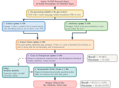

# ScholarlM :microscope: :books:

Extract structured measurements from scientific PDFs using large language models.
Supports local open-weight models via vLLM.

Core capabilities:
- **Document OCR** — convert PDF pages to markdown text with HTML table extraction
- **Measurement extraction** — extract (entity, attribute, value) triplets from text and tables
- **Judgement** - Judge and assign confidence scores to extracted data

<div align="center">
  
</div>

## Installation

**Prerequisites:** Python 3.12+; GPU required for local inference (vLLM / transformers / nnsight).

```bash
git clone https://github.com/yourusername/scholarlm.git
cd scholarlm

uv sync --no-extra gpu   # CPU-only / API-backed workflows
uv sync                  # Full install including local GPU inference
```

Alternative (pip):
```bash
python -m venv .venv && source .venv/bin/activate && pip install -U pip
pip install -e .          # CPU-only
pip install -e ".[gpu]"   # Full
```

## Data

While we do not directly share the PDF documents used for our experiments, they are documented by title, author, and identifying information 
for both the [pond (PLW)](data/pond/directory.json) and the [nitrogen fixation (NF)](data/nfix/directory.json) datasets. Please note the 
sources which these datasets originated from:
1. Richardson, David C., et al. "A functional definition to distinguish ponds from lakes and wetlands." Scientific reports 12.1 (2022): 10472.
2. Fulweiler, Robinson W., et al. "A global dataset of nitrogen fixation rates across inland and coastal waters." Limnology and oceanography letters 10.3 (2025): 412-429.


In addition, we share pre-processed reviewed datasets for [PLW](data/pond/ground_truth_review.json) and [NF](data/pond/ground_truth_review.json), which 
are used for comparison against our extracted data. In addition, we share a sample extracted dataset from `gemma-3-27b`. 

## Prompts, Schemas, and Configs
The core set of [prompts](src/scholarlm/instruction_prompts.py) for all experiments is shared, as well as complete schemas for both [PLW](experiments/configs/pond.py) and [NF](experiments/configs/nfix.py)

In addition all LLM model information (including parameters and source repository names) are shared [here](experiments/model_registry.py). 

## Experiments
Please see the [experiments](experiments/README.md) directory for the full workflow guide. The following are some quick examples.

```bash
# Extract
python experiments/run_extraction.py --dataset pond --model gemma-3-27b

# Judge with a local model
python experiments/run_judge_local.py \
        --dataset pond  --extraction-model gemma-3-27b \
        --judge gpt-oss-120b --api-base http://localhost:{PORT}/v1

# Judge and collect model activations (attention head & layer output) 
python experiments/run_judge_interp.py \
    --dataset pond --extraction-model gemma-3-27b \
    --judge llama-3.1-8b --extraction-date 2026_04_01
```

## Examples
Please see the [demo](demo.ipynb) notebook for a look at how the extraction system operates. 

## License

MIT — see [LICENSE](LICENSE).
